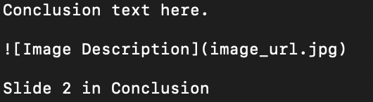

% Title of the Presentation
% Author Name
% Presentation Date

# Section 1: Introduction

## Slide 1 Title

- Point 1
- Point 2
- Point 3

## Slide 2 Title

This is a paragraph in Slide 2.

*Italic text*, **Bold text**

# Section 2: Main Content

## Slide 1 in Main Content

Here is some text.

- Bullet list item 1
- Bullet list item 2

## Slide 2 in Main Content

> This is a blockquote.

# Section 3: Conclusion

## Slide 1 in Conclusion

Conclusion text here.

## Slide 2 in Conclusion

Final thoughts or summary.
